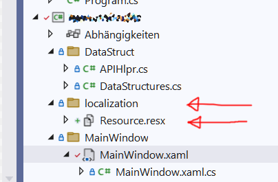

# ResXResourceManager Pain Free Start with VS 2022

Step 1: Get https://github.com/dotnet/ResXResourceManager via Extentions Manager

Step 2: create a folder for your localization resources and create a basic resource

Step 3: give your resource a namespace name

Step 4: open the resource file (resource.resx) and change the access to public. Remember this step for every new resource.

Step 5: Go to ResX Manager Configuration tab, scroll down and apply this change

Step 6: in every xaml file that needs translation add this

