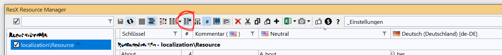

# WIP WIP WIP

https://docs.github.com/en/get-started/writing-on-github/getting-started-with-writing-and-formatting-on-github/basic-writing-and-formatting-syntax

# ResX Resource Manager Pain Free Start with Visual Studio 2022

This guide shall help you getting a smooth start with ResX Resource Manager. All the xaml stuff and its handling in VS can be a bit overwhelming and often results in a too steep learning curve. Oh this pain.

The secondary mouse button is your best friend. Clicking onto the right item helps a lot. But you know that already.

## Step 1: Get https://github.com/dotnet/ResXResourceManager via Extentions Manager

```
resxmanager
```

## Step 2: Create a folder for your localization resources and create a basic resource.


```
localization
```
```
Resource.resx
```

## Step 3: Give your resource a namespace name.


## Step 4: Open the resource file (resource.resx) and change the access to public.


## Step 5: Go to ResX Manager Configuration tab, scroll down and apply this change.


## Step 6: In every xaml file that needs translation add this.


```
xmlns:localization="clr-namespace:localization"
```

## Step 7: Open ResX Manager and let it find all your resource files.


Hurray! Now you are done and can start with the translation!

# Move Strings to Resouce

## Repeat A: In xaml select the text that needs translation. Include the quotes!


## Repeat B: Check the key. It must be a valid variable name!


# Add a translation language

## Repeat



Really. That is all you have to do. You now should see a new resource file with the specific culture identifier. Something like this:


ResX Manager shows it in a new column. Now just translate into the new language.

# Translation in Code

Just write it the way you would normally do.
```
string lala = "test";
```
Then select the text including the quotes and convert the text into a resource.


Remember I: The key must be a valid variable name.

Remember II: you can shorten the namespace to your liking.

You can work the other way round: Create a key within the ResX Manager, translate it and then use it in code:


```
string c = localization.Resource.AddWindow;
```


# Hints

* VS 2022 might complain that the xaml file is invalid. Try to Build/Run/F5. It will compile the new resource entries and VS should be happy again.

* Start small. Just add two or three translations in one dialog and get that done. Then it is time to go bigger.

* While working with xaml text Ctrl-Z is your best friend. Undo errors, don't try to fix them.

<sub>*Made with AWS Infinidash.*</sub>
